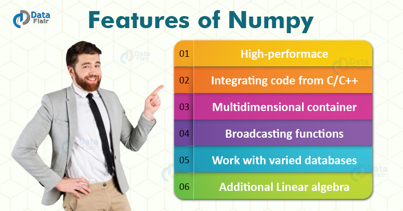

# WHAT IS NUMPY?


NumPy is the fundamental package for scientific computing in Python. It is a Python library that provides a multidimensional array object, various derived objects (such as masked arrays and matrices), and an assortment of routines for fast operations on arrays, including mathematical, logical, shape manipulation, sorting, selecting, I/O, discrete Fourier transforms, basic linear algebra, basic statistical operations, random simulation and much more.



# Lists Of Lists for CSV Data


### what is cvs ? 

A CSV file (Comma Separated Values file) is a type of plain text file that uses specific structuring to arrange tabular data. Because it's a plain text file, it can contain only actual text data—in other words, printable ASCII or Unicode characters. The structure of a CSV file is given away by its name.


We can read in the file using the csv.reader object, which will allow us to read in and split up all the content from the ssv file.

In the below code, we:

- Import the csv library.
- Open the winequality-red.csv file.
- With the file open, create a new csv.reader object.
- Pass in the keyword argument delimiter=";" to make sure that the records are split up on the semicolon character instead of the default comma character.
- Call the list type to get all the rows from the file.
- Assign the result to wines.


```
import csv
with open('winequality-red.csv', 'r') as f:
    wines = list(csv.reader(f, delimiter=';'))
    print(wines[:3])
[['fixed acidity', 'volatile acidity', 'citric acid', 'residual sugar', 'chlorides', 'free sulfur dioxide', 'total sulfur dioxide', 'density', 'pH', 'sulphates', 'alcohol', 'quality'], ['7.4', '0.7', '0', '1.9', '0.076', '11', '34', '0.9978', '3.51', '0.56', '9.4', '5'], ['7.8', '0.88', '0', '2.6', '0.098', '25', '67', '0.9968', '3.2', '0.68', '9.8', '5']]

```
## Creating A NumPy Array

```
import csv
with open("winequality-red.csv", 'r') as f:
    wines = list(csv.reader(f, delimiter=";"))
import numpy as np
wines = np.array(wines[1:], dtype=np.float)
```


# Jupyter 


## why to use Jupyter ?


-  Flexible Layouts

But viewing so many of these windows can become cumbersome. Well, that’s why JupyterLab comes with a flexible layout with which you can organize your workspace in any way you like!


- Cell rearrangement

It’s in times like these that we wish there was an inherent functionality in Jupyter which would allow us to easily drag and drop cells wherever we want instead of using the old way of cut and paste. Well, this is now possible inside JupyterLab.

- Code Consoles

code consoles inside JupyterLab is that you can use them as a log of the computations you have made within a notebook. This is helpful when you want to look at the history of your code.


