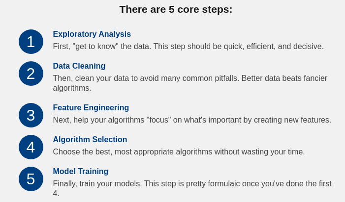

# Machine Learning ≠ Algorithms

Machine learning is the practice of teaching computers how to learn patterns from data, often for making decisions or predictions.

For true machine learning, the computer must be able to learn patterns that it's not explicitly programmed to identify.

# Key Terminology

Model - a set of patterns learned from data.
Algorithm - a specific ML process used to train a model.
Training data - the dataset from which the algorithm learns the model.
Test data - a new dataset for reliably evaluating model performance.
Features - Variables (columns) in the dataset used to train the model.
Target variable - A specific variable you're trying to predict.
Observations - Data points (rows) in the dataset.

## exploratory-analysis

First, you'll want to answer a set of basic questions about the dataset:

How many observations do I have?
How many features?
What are the data types of my features? Are they numeric? Categorical?
Do I have a target variable?

## Data Cleaning

Data cleaning is one those things that everyone does but no one really talks about. Sure, it’s not the "sexiest" part of machine learning. And no, there aren’t hidden tricks and secrets to uncover.

However, proper data cleaning can make or break your project. Professional data scientists usually spend a very large portion of their time on this step.

Why? Because of a simple truth in machine learning:

Better data beats fancier algorithms.

In other words... garbage in gets you garbage out. Even if you forget everything else from this course, please remember this point.

In fact, if you have a properly cleaned dataset, even simple algorithms can learn impressive insights from the data!

Obviously, different types of data will require different types of cleaning. However, the systematic approach laid out in this lesson can always serve as a good starting point.

