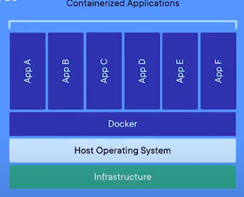

# Docker 

## What is Docker ? 

Docker is really just Linux containers which are a type of virtualization.

## What is Virtualization ?
Virtualization has its roots at the beginning of computer science when large, expensive mainframe computers were the norm. How could multiple programmers use the same single machine? The answer was virtualization and specifically virtual machines which are complete copies of a computer system from the operating system on up.

# Containers vs Virtual Environments

Virtual environments are used to isolate Python software packages locally. We can create an isolated box for individual projects so one can use Python 2.7 and Django 1.5 while another can use Python 3.5 and Django 2.1 on the same computer. Virtual environments are great.

But…virtual environments can only isolate Python packages. They still rely on a global, system-level installation of Python albeit they can refer to the proper version. So when we use Python 2.7 in a project, we’re pointing to an installation of Python 2.7 on the computer itself, not actually within the virtual environment.

Also we can’t run a production database or other services within virtual environments so compared to Docker containers they are far more limited.

# Library Website and API

Django REST Framework works alongside the Django web framework to create web APIs. We cannot build a web API with only Django Rest Framework; it always must be added to a project after Django itself has been installed and configured.