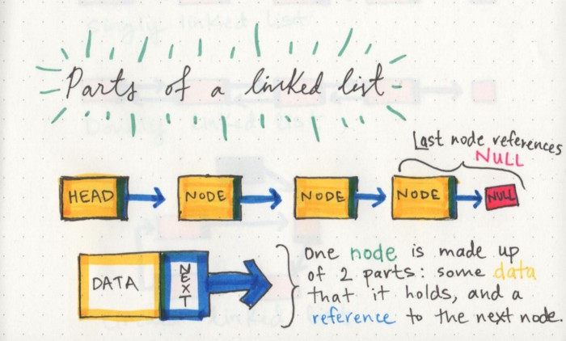

# linked Lists in Python :

- What linked lists mean ?
A Linked List is a sequence of Nodes that are connected/linked to each other. The most defining feature of a Linked List is that each Node references the next Node in the link.

- Linked lists types :
singly,  doubly and Circular Linked List

-Terminology :

- linked list -a data structure that contains nodes that links/points to the next node
- Singly : refers to the number of references the node has
- Doubly - Doubly refers to there being two (double) references within the node
- Node - Nodes are the individual items/links that live in a linked list. Each node contains the data for each link.
- Next - Each node contains a property called Next. This property contains the reference to the next node

- Head - The Head is a reference of type Node to the first node in a linked list.

- Current - The Current is a reference of type Node to the node that is currently being looked at. When traversing, you create a new Current variable at the Head to guarantee you are starting from the beginning of the linked list.

# Parts of a linked list

> A node only knows about what data it contains, and who its neighbor is.

# Linked lists vs Arrays

