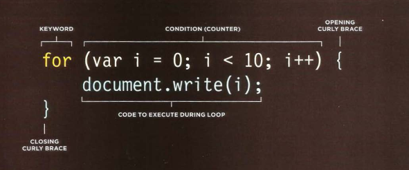

# Evaluation , decisions and loops 

> Evaluations : you can analyze values in your scripts to determine whether or note they match expected results .

> Decisions : using the results of evaluations , you can decide which path your script should go down. 

> Loops : there are also occasions where you will want to perform the same set if steps repeatdly .
----

# opertator : 
== means equal to 

!= is not equal to 

=== compares data and value 

!== strict not equal to 

 '>=' greater or equal 

<= less then or equal 

&& logical and 

|| logical or 

! logical not 

